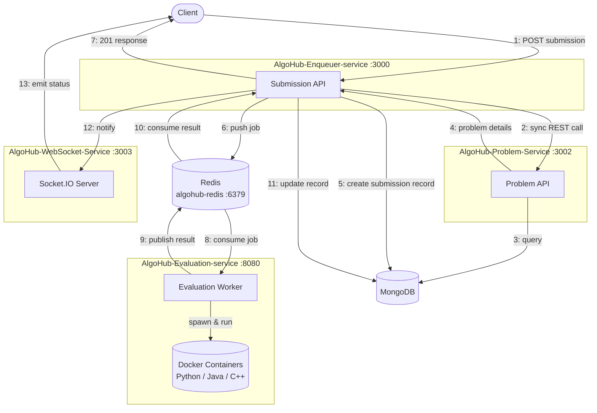

# 🚀 AlgoHub : Code Submission & Evaluation Platform

**AlgoHub** is a scalable, distributed code submission and evaluation platform where users can solve DSA and programming problems, submit solutions, and receive real-time evaluation results.

This system is designed using a **microservices architecture** with queue-based communication and isolated Docker-based code execution for safety and scalability.

> Scroll down to watch the demo video for a full walkthrough of the execution flow and results.

---

# 🧠 Overview

The platform allows:

-  Admins to post DSA / programming problems  
-  Users to submit code solutions  
-  Backend services to process submissions asynchronously  
-  Secure execution of user code inside Docker containers  
-  Automatic test case validation  
-  Real-time status updates to users via webSockets

---

# Project Structure

```
AlgoHub/
│
├── AlgoHubFrontend/
│   └── User interface for browsing problems, submitting code, and viewing results.
│
└── AlgoHubBackend/
    │
    ├── AlgoHub-Enqueuer-service/
    │   └── Receives submissions, stores metadata, and enqueues evaluation jobs.
    │
    ├── AlgoHub-Evaluation-service/
    │   └── Executes code in docker containers, runs it against test cases and publishes evaluation results.
    │
    ├── AlgoHub-Problem-Service/
    │   └── Manages problem statements, test cases, and related problem data APIs.
    │
    └── AlgoHub-WebSocket-Service/
        └── Pushes real-time submission and evaluation updates to connected clients.
```

---

# 🏗️ Architecture Diagram



---

---

# 🔄 Submission Flow

***1. The client sends a submission request to the Submission Service.***

***2. The Submission Service makes a synchronous call to the Problem Service to retrieve problem details.***

***3. The Problem Service queries the database to fetch the required problem data.***

***4. The Problem Service returns the problem details to the Submission Service.***

***5. The Submission Service creates a new submission record in the database.***

***6. The Submission Service pushes the submission payload (with the updated stub) into the Submission Redis Queue.***

***7. The Submission Service responds to the client, confirming the submission was successfully created.***

***8. The Evaluator Service consumes the submission message from the Submission Redis Queue and executes the code inside an isolated Docker container.***

***9. After evaluation and test case verification, the Evaluator Service publishes the result to the Evaluation Redis Queue.***

***10. The Submission Service consumes the evaluation result from the Evaluation Redis Queue.***

***11. The Submission Service updates the submission record in the database with the evaluation result.***

***12. The Submission Service notifies the WebSocket Service of the updated submission status.***

***13. The WebSocket Service pushes the final result to the client over the active socket connection.***

---

# 🎥 Project Demo

**A complete walkthrough of the workflow and live code execution is available here:**

[](https://youtu.be/A7Ndz_8rat0)

**Video:** https://youtu.be/A7Ndz_8rat0


---

# ⚙️ Project Setup & Backend Details
## Backend
Detailed setup instructions, environment variables, and service-specific configuration for each backend microservice are documented separately.

👉 **[View full backend setup guide](./AlgoHubBackend/README.md)**
## Frontend

> Use the provided `.env.example` file — copy it to `.env` and fill in the required values

```bash
cd AlgoHubFrontend
npm install
npm run dev
```

---
## 🧠 Project Focus

AlgoHub emphasizes:

- **Microservice-based** backend architecture
- **Queue-driven asynchronous job processing**
- **Secure Docker-based execution** of untrusted code
- **Real-time updates** using WebSockets (Socket.IO)
- Clean service separation and **scalability**

---

## 🖥️ Frontend

While the primary focus of this project is the backend architecture, a modern React frontend has been developed to provide a complete end-to-end experience.

### Features

* Browse available coding problems
* Monaco Editor with language selection
* Dynamic code templates (stubs) for each language
* Submit solutions for execution
* Real-time submission status updates via Socket.IO
* View verdicts, execution results, and test case outcomes
* Responsive and clean UI built for demonstration and testing

The frontend serves as a client for the backend microservices, allowing users to:

* Interact with the complete code execution pipeline
* Experience live updates without page refreshes
* Validate end-to-end communication between services
* Demonstrate the backend architecture through a production-like interface

> **Note:** The frontend is intentionally lightweight, as the project's primary objective is to showcase the backend microservices architecture, asynchronous job processing, Docker-based code execution, and real-time communication.


## ⚙️ Tech Stack

### Backend
- **Node.js**
- **Express**
- **Fastify**
- **TypeScript**
- **Socket.IO**
- **MongoDB**
- **Redis (Queue Layer)**
- **Docker**

### Frontend
- **React**
- **TypeScript**
- **Socket.IO Client**
- **Tailwind CSS**

---

## 📈 Scalability Design

- Stateless backend services
- Redis-based queue decoupling
- Multiple evaluator instances supported
- Socket connection mapping with in-memory + Redis cache
- Horizontally scalable architecture

---

## 🛡️ Security Model

- Docker-based isolated execution
- Resource-constrained containers
- Timeout enforcement
- No direct DB access from execution container
- Controlled runtime environments

---

> Thanks for checking out AlgoHub!
